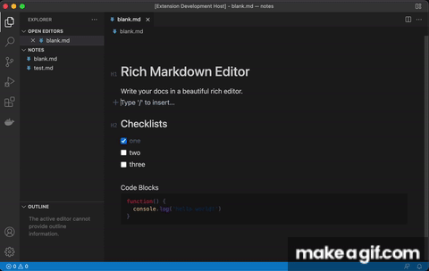

# Rich Markdown Editor

Edit markdown files with a rich editor in the style of Dropbox Paper/Notion etc.

<p align="center">

</p>

Perfect for writing docs, authoring blog posts, and editing markdown website content.

## Features

* Preview and edit in a single view
* Format with markdown syntax or slash commands
* Syntax highlighting for code blocks
* Easily add tables, checkboxes, dividers, quotes, links etc


This extension replaces the default code editor for markdown files with a rich version, allowing you to "edit" in preview mode.

It uses the [rich-markdown-editor](https://github.com/outline/rich-markdown-editor) project generously open sourced by [Outline](https://www.getoutline.com/)


**NOTE:** If you use “prettier” as your default formatter, you can disable it for markdown files to prevent the cursor position from resetting on each format. Add this to your `settings.json`:

```javascript
  "[markdown]": {
    "editor.formatOnSave": false
  },
```


